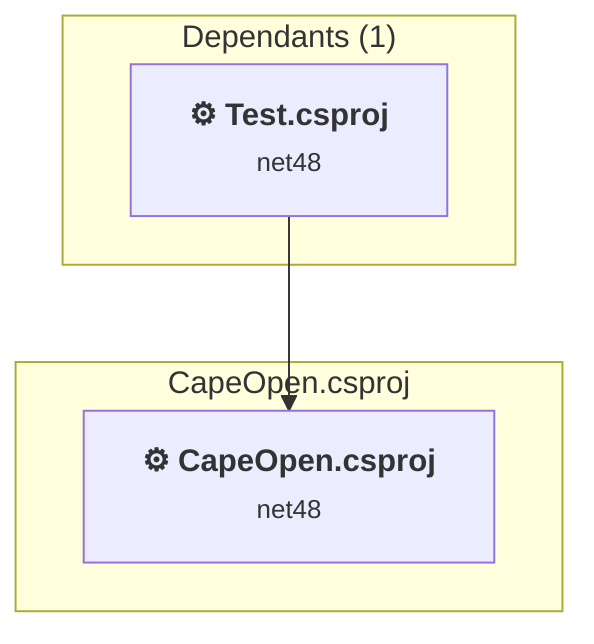
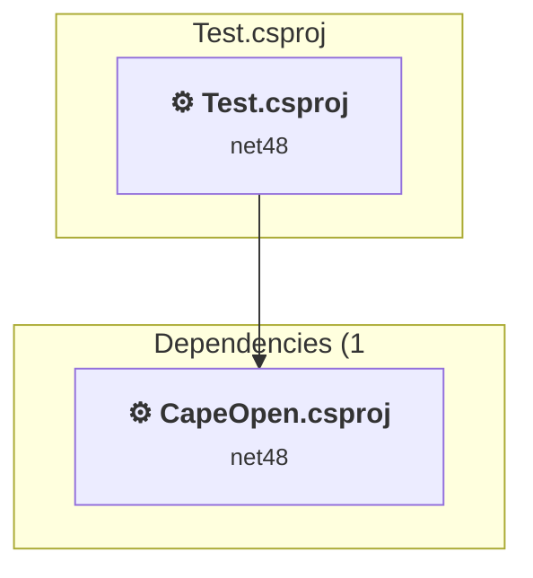

# Projects and dependencies analysis

This document provides a comprehensive overview of the projects and their dependencies in the context of upgrading to .NETCoreApp,Version=v8.0.

## Table of Contents

- [Executive Summary](#executive-Summary)
  - [Highlevel Metrics](#highlevel-metrics)
  - [Projects Compatibility](#projects-compatibility)
  - [Package Compatibility](#package-compatibility)
  - [API Compatibility](#api-compatibility)
- [Aggregate NuGet packages details](#aggregate-nuget-packages-details)
- [Top API Migration Challenges](#top-api-migration-challenges)
  - [Technologies and Features](#technologies-and-features)
  - [Most Frequent API Issues](#most-frequent-api-issues)
- [Projects Relationship Graph](#projects-relationship-graph)
- [Project Details](#project-details)

  - [CapeOpen\CapeOpen.csproj](#capeopencapeopencsproj)
  - [Test\Test.csproj](#testtestcsproj)

## Executive Summary

### Highlevel Metrics

| Metric | Count | Status |
| :--- | :---: | :--- |
| Total Projects | 2 | All require upgrade |
| Total NuGet Packages | 0 | All compatible |
| Total Code Files | 50 |  |
| Total Code Files with Incidents | 22 |  |
| Total Lines of Code | 44121 |  |
| Total Number of Issues | 2409 |  |
| Estimated LOC to modify | 2405+ | at least 5.5% of codebase |

### Projects Compatibility

| Project | Target Framework | Difficulty | Package Issues | API Issues | Est. LOC Impact | Description |
| :--- | :---: | :---: | :---: | :---: | :---: | :--- |
| [CapeOpen\CapeOpen.csproj](#capeopencapeopencsproj) | net48 | 🟡 Medium | 0 | 2405 | 2405+ | ClassicWinForms, Sdk Style = False |
| [Test\Test.csproj](#testtestcsproj) | net48 | 🟢 Low | 0 | 0 |  | ClassicClassLibrary, Sdk Style = False |

### Package Compatibility

| Status | Count | Percentage |
| :--- | :---: | :---: |
| ✅ Compatible | 0 | 0.0% |
| ⚠️ Incompatible | 0 | 0.0% |
| 🔄 Upgrade Recommended | 0 | 0.0% |
| ***Total NuGet Packages*** | ***0*** | ***100%*** |

### API Compatibility

| Category | Count | Impact |
| :--- | :---: | :--- |
| 🔴 Binary Incompatible | 2339 | High - Require code changes |
| 🟡 Source Incompatible | 66 | Medium - Needs re-compilation and potential conflicting API error fixing |
| 🔵 Behavioral change | 0 | Low - Behavioral changes that may require testing at runtime |
| ✅ Compatible | 15179 |  |
| ***Total APIs Analyzed*** | ***17584*** |  |

## Aggregate NuGet packages details

| Package | Current Version | Suggested Version | Projects | Description |
| :--- | :---: | :---: | :--- | :--- |

## Top API Migration Challenges

### Technologies and Features

| Technology | Issues | Percentage | Migration Path |
| :--- | :---: | :---: | :--- |
| Windows Forms | 2325 | 96.7% | Windows Forms APIs for building Windows desktop applications with traditional Forms-based UI that are available in .NET on Windows. Enable Windows Desktop support: Option 1 (Recommended): Target net9.0-windows; Option 2: Add <UseWindowsDesktop>true</UseWindowsDesktop>; Option 3 (Legacy): Use Microsoft.NET.Sdk.WindowsDesktop SDK. |
| Windows Forms Legacy Controls | 207 | 8.6% | Legacy Windows Forms controls that have been removed from .NET Core/5+ including StatusBar, DataGrid, ContextMenu, MainMenu, MenuItem, and ToolBar. These controls were replaced by more modern alternatives. Use ToolStrip, MenuStrip, ContextMenuStrip, and DataGridView instead. |
| GDI+ / System.Drawing | 67 | 2.8% | System.Drawing APIs for 2D graphics, imaging, and printing that are available via NuGet package System.Drawing.Common. Note: Not recommended for server scenarios due to Windows dependencies; consider cross-platform alternatives like SkiaSharp or ImageSharp for new code. |
| COM Interop Changes | 2 | 0.1% | COM-specific APIs that have changes or removals in .NET Core/.NET due to cross-platform considerations. Some COM interop functionality requires Windows-specific features. Review COM interop requirements; some APIs require Windows Compatibility Pack. |

### Most Frequent API Issues

| API | Count | Percentage | Category |
| :--- | :---: | :---: | :--- |
| T:System.Windows.Forms.Label | 162 | 6.7% | Binary Incompatible |
| T:System.Windows.Forms.NumericUpDown | 144 | 6.0% | Binary Incompatible |
| T:System.Windows.Forms.TabPage | 94 | 3.9% | Binary Incompatible |
| T:System.Windows.Forms.TrackBar | 88 | 3.7% | Binary Incompatible |
| T:System.Windows.Forms.Button | 85 | 3.5% | Binary Incompatible |
| T:System.Windows.Forms.ToolStripMenuItem | 70 | 2.9% | Binary Incompatible |
| T:System.Windows.Forms.DialogResult | 64 | 2.7% | Binary Incompatible |
| P:System.Windows.Forms.Control.Name | 63 | 2.6% | Binary Incompatible |
| T:System.Windows.Forms.Control.ControlCollection | 60 | 2.5% | Binary Incompatible |
| P:System.Windows.Forms.Control.Controls | 60 | 2.5% | Binary Incompatible |
| M:System.Windows.Forms.Control.ControlCollection.Add(System.Windows.Forms.Control) | 59 | 2.5% | Binary Incompatible |
| P:System.Windows.Forms.Control.Size | 58 | 2.4% | Binary Incompatible |
| P:System.Windows.Forms.Control.TabIndex | 54 | 2.2% | Binary Incompatible |
| P:System.Windows.Forms.Control.Location | 54 | 2.2% | Binary Incompatible |
| T:System.Windows.Forms.ComboBox | 41 | 1.7% | Binary Incompatible |
| P:System.Windows.Forms.NumericUpDown.Value | 40 | 1.7% | Binary Incompatible |
| T:System.Windows.Forms.DataGridView | 39 | 1.6% | Binary Incompatible |
| T:System.Windows.Forms.AnchorStyles | 34 | 1.4% | Binary Incompatible |
| T:System.Windows.Forms.MenuStrip | 30 | 1.2% | Binary Incompatible |
| T:System.Windows.Forms.CheckBox | 29 | 1.2% | Binary Incompatible |
| T:System.Windows.Forms.TabControl | 28 | 1.2% | Binary Incompatible |
| T:System.Windows.Forms.CheckedListBox | 28 | 1.2% | Binary Incompatible |
| T:System.Windows.Forms.TreeNode | 25 | 1.0% | Binary Incompatible |
| T:System.Windows.Forms.MessageBox | 24 | 1.0% | Binary Incompatible |
| T:System.Windows.Forms.TreeNodeCollection | 20 | 0.8% | Binary Incompatible |
| T:System.Windows.Forms.TreeView | 19 | 0.8% | Binary Incompatible |
| P:System.Windows.Forms.Label.Text | 18 | 0.7% | Binary Incompatible |
| P:System.Windows.Forms.Label.AutoSize | 16 | 0.7% | Binary Incompatible |
| M:System.Windows.Forms.Label.#ctor | 16 | 0.7% | Binary Incompatible |
| T:System.Windows.Forms.DockStyle | 15 | 0.6% | Binary Incompatible |
| T:System.Windows.Forms.TextBox | 15 | 0.6% | Binary Incompatible |
| T:System.Windows.Forms.DataGridViewTextBoxColumn | 15 | 0.6% | Binary Incompatible |
| M:System.Windows.Forms.MessageBox.Show(System.String) | 14 | 0.6% | Binary Incompatible |
| T:System.Windows.Forms.PropertyGrid | 12 | 0.5% | Binary Incompatible |
| M:System.Windows.Forms.Control.ResumeLayout(System.Boolean) | 12 | 0.5% | Binary Incompatible |
| T:System.Windows.Forms.AutoScaleMode | 12 | 0.5% | Binary Incompatible |
| M:System.Windows.Forms.Control.SuspendLayout | 12 | 0.5% | Binary Incompatible |
| M:System.Windows.Forms.TreeNodeCollection.Add(System.Windows.Forms.TreeNode) | 12 | 0.5% | Binary Incompatible |
| M:System.Windows.Forms.TreeNode.#ctor(System.String) | 12 | 0.5% | Binary Incompatible |
| T:System.Windows.Forms.ListBox | 12 | 0.5% | Binary Incompatible |
| P:System.Windows.Forms.TreeNode.Nodes | 11 | 0.5% | Binary Incompatible |
| T:System.Windows.Forms.DataGridViewRowCollection | 11 | 0.5% | Binary Incompatible |
| P:System.Windows.Forms.DataGridView.Rows | 11 | 0.5% | Binary Incompatible |
| T:System.Windows.Forms.DataGridViewComboBoxColumn | 11 | 0.5% | Binary Incompatible |
| M:System.Windows.Forms.MessageBox.Show(System.String,System.String) | 10 | 0.4% | Binary Incompatible |
| P:System.Windows.Forms.ToolStripItem.Size | 10 | 0.4% | Binary Incompatible |
| P:System.Windows.Forms.ToolStripItem.Name | 10 | 0.4% | Binary Incompatible |
| P:System.Windows.Forms.ButtonBase.UseVisualStyleBackColor | 9 | 0.4% | Binary Incompatible |
| P:System.Windows.Forms.ButtonBase.Text | 9 | 0.4% | Binary Incompatible |
| M:System.Windows.Forms.ToolStripMenuItem.#ctor | 9 | 0.4% | Binary Incompatible |

## Projects Relationship Graph

Legend:
📦 SDK-style project
⚙️ Classic project

## Project Details

### CapeOpen\CapeOpen.csproj

#### Project Info

- **Current Target Framework:** net48
- **Proposed Target Framework:** net8.0-windows
- **SDK-style**: False
- **Project Kind:** ClassicWinForms
- **Dependencies**: 0
- **Dependants**: 1
- **Number of Files**: 54
- **Number of Files with Incidents**: 21
- **Lines of Code**: 43716
- **Estimated LOC to modify**: 2405+ (at least 5.5% of the project)

#### Dependency Graph

Legend:
📦 SDK-style project
⚙️ Classic project

### API Compatibility

| Category | Count | Impact |
| :--- | :---: | :--- |
| 🔴 Binary Incompatible | 2339 | High - Require code changes |
| 🟡 Source Incompatible | 66 | Medium - Needs re-compilation and potential conflicting API error fixing |
| 🔵 Behavioral change | 0 | Low - Behavioral changes that may require testing at runtime |
| ✅ Compatible | 15068 |  |
| ***Total APIs Analyzed*** | ***17473*** |  |

#### Project Technologies and Features

| Technology | Issues | Percentage | Migration Path |
| :--- | :---: | :---: | :--- |
| COM Interop Changes | 2 | 0.1% | COM-specific APIs that have changes or removals in .NET Core/.NET due to cross-platform considerations. Some COM interop functionality requires Windows-specific features. Review COM interop requirements; some APIs require Windows Compatibility Pack. |
| Windows Forms Legacy Controls | 207 | 8.6% | Legacy Windows Forms controls that have been removed from .NET Core/5+ including StatusBar, DataGrid, ContextMenu, MainMenu, MenuItem, and ToolBar. These controls were replaced by more modern alternatives. Use ToolStrip, MenuStrip, ContextMenuStrip, and DataGridView instead. |
| GDI+ / System.Drawing | 67 | 2.8% | System.Drawing APIs for 2D graphics, imaging, and printing that are available via NuGet package System.Drawing.Common. Note: Not recommended for server scenarios due to Windows dependencies; consider cross-platform alternatives like SkiaSharp or ImageSharp for new code. |
| Windows Forms | 2325 | 96.7% | Windows Forms APIs for building Windows desktop applications with traditional Forms-based UI that are available in .NET on Windows. Enable Windows Desktop support: Option 1 (Recommended): Target net9.0-windows; Option 2: Add <UseWindowsDesktop>true</UseWindowsDesktop>; Option 3 (Legacy): Use Microsoft.NET.Sdk.WindowsDesktop SDK. |

### Test\Test.csproj

#### Project Info

- **Current Target Framework:** net48
- **Proposed Target Framework:** net8.0
- **SDK-style**: False
- **Project Kind:** ClassicClassLibrary
- **Dependencies**: 1
- **Dependants**: 0
- **Number of Files**: 2
- **Number of Files with Incidents**: 1
- **Lines of Code**: 405
- **Estimated LOC to modify**: 0+ (at least 0.0% of the project)

#### Dependency Graph

Legend:
📦 SDK-style project
⚙️ Classic project

### API Compatibility

| Category | Count | Impact |
| :--- | :---: | :--- |
| 🔴 Binary Incompatible | 0 | High - Require code changes |
| 🟡 Source Incompatible | 0 | Medium - Needs re-compilation and potential conflicting API error fixing |
| 🔵 Behavioral change | 0 | Low - Behavioral changes that may require testing at runtime |
| ✅ Compatible | 111 |  |
| ***Total APIs Analyzed*** | ***111*** |  |

